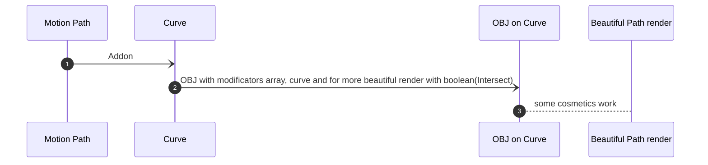
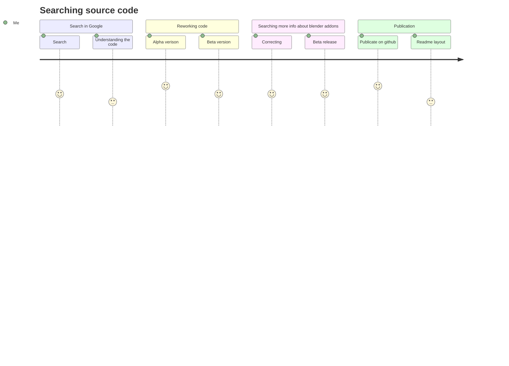

# MotionPath Converter To Curve Blender Addon
Addon for blender to convert motion path in curve for more comfort worl

This converter can help you solve many type of task like you need to make vizualisation of motion path on render. 

After installing you need to press F3 and search `Convert Motion Path to Curve` after you will see new object on scene `Curve`.

For correct work you need to keep on scene only 1 motion path and end must equal with end frame of animation.

#### All code wasn't completely written by me. I'm just rework source code for more comfortable work with motion paths.

## Comparing paths with differents settings of boolea on obj

### 1. With Intersect on boolean

### 2. Without Intersect on boolean

## Working on addon

## Future Plans

### 1. Make diffents version of addon like context menu
### 2. Fix error that you can't do curve if you turn more than 1 motion path
### 3. Make more flexable
### 4. Do automatic creation of path with objects
