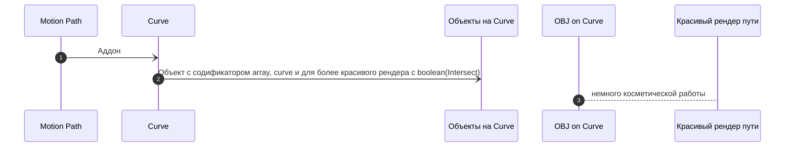
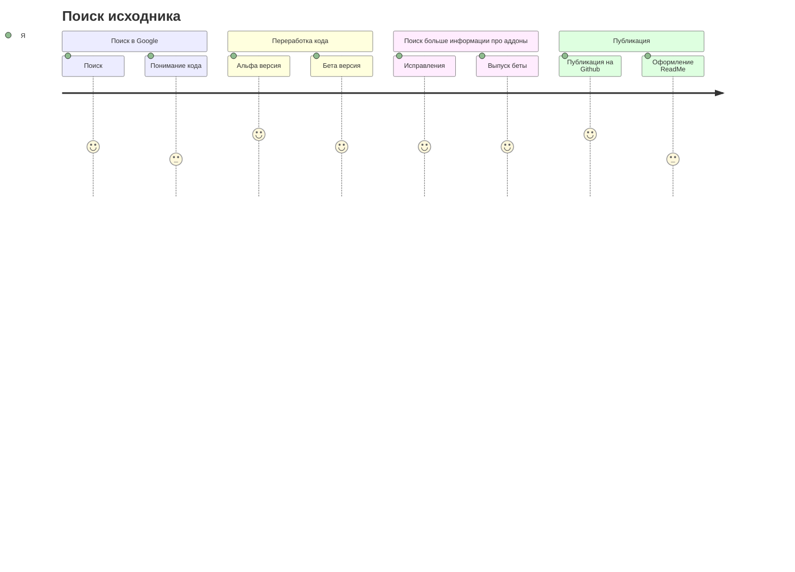

# MotionPath Converter To Curve Blender Addon
Addon для более удобной работы с путями в blender с помощью Curve

Этот конвертер поможет вам решить такие проблемы, как красивый рендер пути, визуализация пути на рендере, привязка другив объектов к путям.

## Содержание

1.    [Запуск](https://github.com/XRenso/MotionPathConverterBlender/blob/main/docs/ru/introduction.md#запуск)
2.    [Сравнение модификатора Boolean](https://github.com/XRenso/MotionPathConverterBlender/blob/main/docs/ru/introduction.md#сравнение-модификатора-boolean)   
    1.    [С Intersect на boolean](https://github.com/XRenso/MotionPathConverterBlender/blob/main/docs/ru/introduction.md#сравнение-модификатора-boolean)
    .    
    2.    [Без Intersect на boolean](https://github.com/XRenso/MotionPathConverterBlender/blob/main/docs/ru/introduction.md#сравнение-модификатора-boolean)
    .
3.  [Работа над аддоном](https://github.com/XRenso/MotionPathConverterBlender/blob/main/docs/ru/introduction.md#работа-над-аддоном)
4.  [Планы на будущее](https://github.com/XRenso/MotionPathConverterBlender/blob/main/docs/ru/introduction.md#планы-на-будущее)
    1.    [Сделать разные версии(контекст меню и т.д)](https://github.com/XRenso/MotionPathConverterBlender/blob/main/docs/ru/introduction.md#1-сделать-разные-версииконтекст-меню-и-тд)
    2.    [Сделать более практичным](https://github.com/XRenso/MotionPathConverterBlender/blob/main/docs/ru/introduction.md#2-сделать-более-практичным)
    3.    [Сделать автоматическое создание объектов привязанных к пути](https://github.com/XRenso/MotionPathConverterBlender/blob/main/docs/ru/introduction.md#3-сделать-автоматическое-создание-объектов-привязанных-к-пути)

## Запуск
После установки вам нужно нажать F3 и найти `Convert Motion Path to Curve` , после вы увидите объект на сцене с названием `*obj_name*_path`.

#### Весь код не был полностью написан мной. Я просто пределываю исходник для более удобной работы с motion path.

#### [К оглавлению :arrow_up:](https://github.com/XRenso/MotionPathConverterBlender/blob/main/docs/ru/introduction.md#содержание)

## Сравнение модификатора Boolean
### 1. С Intersect на boolean

### 2. Без Intersect на boolean

#### [К оглавлению :arrow_up:](https://github.com/XRenso/MotionPathConverterBlender/blob/main/docs/ru/introduction.md#содержание)

## Работа над аддоном

#### [К оглавлению :arrow_up:](https://github.com/XRenso/MotionPathConverterBlender/blob/main/docs/ru/introduction.md#содержание)

## Планы на будущее

### 1. Сделать разные версии(контекст меню и т.д)
### 2. Сделать более практичным
### 3. Сделать автоматическое создание объектов привязанных к пути

#### [К оглавлению :arrow_up:](https://github.com/XRenso/MotionPathConverterBlender/blob/main/docs/ru/introduction.md#содержание)
